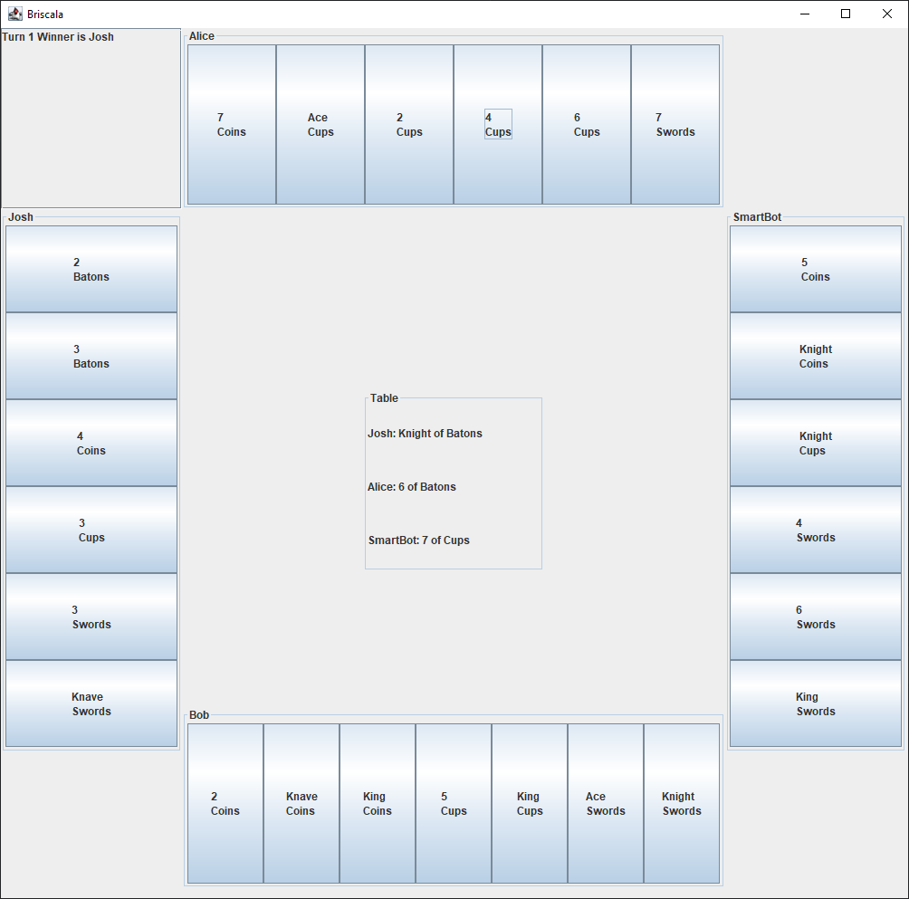

# Introduction

This project's objective is to build an engine capable of generating card games, like "briscola".
The user will be able to, through a DSL, configure and customize a game to his liking; while still keeping some default game rules.


## DSL Syntax Example
### Game name
Allows to set the game's name.
```scala
game is "Briscala"
```

### Game player count
Expects the custom game to have `n` players (between two and four), whether they be human-players or bots.
```scala
game has 4 players
```
### Game players
Setups bots and player each with a custom name.
```scala
game has player called "Alice"
game has smartBot called "SmartBot"
game has player called "Bob"
game has player called "Josh"
```
### Game deck
Allows to set the deck used in this game, only four suits are allowed, while there is no limit to the ranks present.
```scala
game suitsAre("Cups", "Coins", "Swords", "Batons")
game ranksAre("Ace", "2", "3", "4", "5", "6", "7", "Knave", "Knight", "King")
```
### Players' cards in hand
Allows to set the card's distribution in each player's hand, between three and ten cards each.
```scala
game gives 7 cards to every player
```
### First turn
Optional game first turn's starting player.
```scala
game firstTurn starts from "Alice"
```
### Briscola Suit
Optional for games with a "briscola" concept.
```scala
game briscolaIs "Cups"
```
### Hand Rules
Optional for games with custom rules for playing a card, `startWithHigherCard` and `followPreviousSuit` already implement some common rules.
```scala
game hand rules are :
  (cardsOnTable, playerHand, playedCard) =>
    given List[CardModel] = cardsOnTable
    given DeckModel = playerHand
    given CardModel = playedCard

    startWithHigherCard or followPreviousSuit
``` 
### Points Rules
Optional for games with custom rules for cards points' during scoring. In this use case "Aces", "Kings", "Knights" and "Knaves" are assigned points while other ranked cards are assigned none.
Furthermore, cards of "Coins" suit are assigned an additional point.
```scala
game card points are :
  ((name, suit) =>
    name match
      case "Ace" => 5
      case "King" => 2
      case "Knight" => 2
      case "Knave" => 2
      case _ => 0
    , (name, suit) =>
    suit match
      case "Coins" => 1
      case _ => 0
)
```
### Play Rules
Optional for games with custom turn-winning rules. In this use case two rules are combined using "rule prevalence".

Rule prevalence states that whenever the first rule is not applicable then the second rule is applied.
```scala
game play rules are :
  val highestBriscolaTakesRule = (cards: List[(PlayerModel, CardModel)]) =>
  given List[(PlayerModel, CardModel)] = cards
  highest(suit) that takes is briscolaSuit
    
  val highestCardTakesRule = (cards: List[(PlayerModel, CardModel)]) =>
  given List[(PlayerModel, CardModel)] = cards
  highest(rank) that takes follows last card suit
    
  highestBriscolaTakesRule prevailsOn highestCardTakesRule
```
### Win Rules
Optional for games with custom winning rules. In this case the team with the highest joint-sum of points will win the game.
```scala
game win rules is :
  (teams, listOfPlayers) =>
    given List[Team] = teams
    given List[PlayerModel] = listOfPlayers

    highestPointTeam
```

| [Index](../index.md) | [Next Chapter](../2-development_process/index.md) |