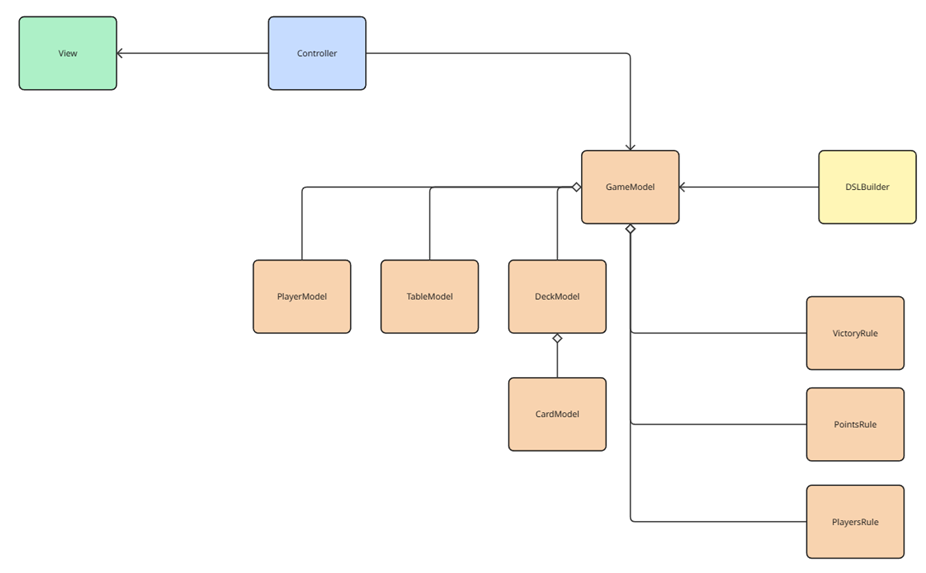

# Architectural Design
The architecture of the project can be split into two main parts:

## DSL
The domain-specific language that allows users to define their own rules and policies. The DSL uses a builder pattern to create the engine model.

## Engine
The core engine that processes the rules and policies defined in the DSL. It is structured on the Model-View-Controller (MVC) pattern:
- **Model**: Represents the data and business logic of the application.
- **View**: The user interface that allows users to interact with the application.
- **Controller**: Handles user input and updates the model and view accordingly.

