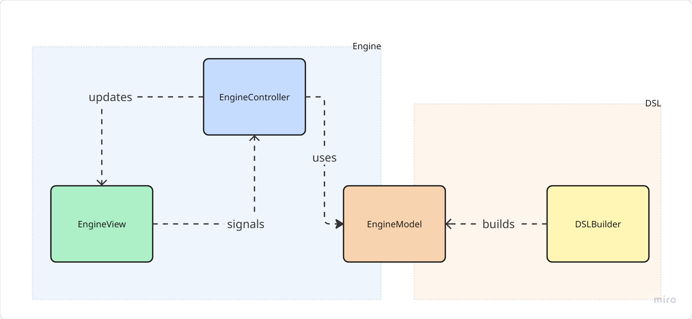

# Architectural Design
The architecture of the project can be split into two main parts: DSL and Engine.

## DSL
The domain-specific language that allows users to define their own rules and policies. 
The DSL uses a builder pattern to create the engine model. It separates the definition of the domain logic (via the DSL) from the final model used in the engine architecture. 
This improves code clarity, flexibility, and maintainability, making it easier to customize and validate domain objects before they are used by controllers and views.

## Engine
The core engine that processes the rules and policies defined in the DSL and handles the game. It is structured on the Model-View-Controller (MVC) pattern:
- **Model**: Represents the data and business logic of the application.
- **View**: The user interface that allows users to interact with the application.
- **Controller**: Handles user input and updates the model and view accordingly.

The MVC architecture ensures a clean separation of responsibilities across the system, improving maintainability and testability. 
This modularity also benefits scalability, making the system easier to extend over time.

| [Previous Chapter](../3-requirements/index.md) | [Index](../index.md) | [Next Chapter](../5-detailed_design/index.md) |