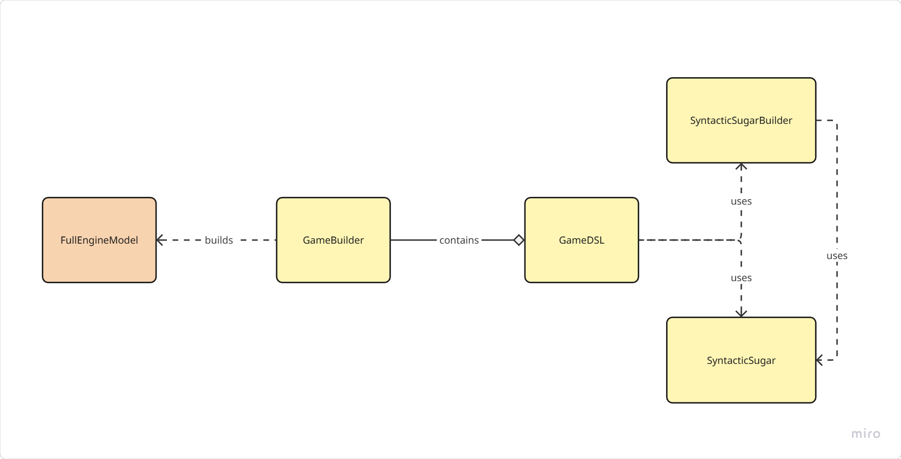
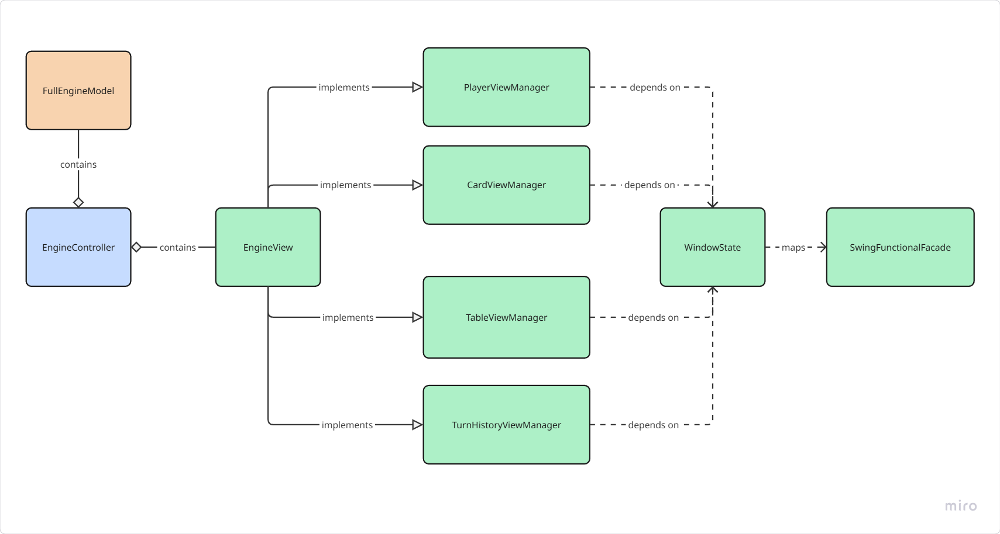
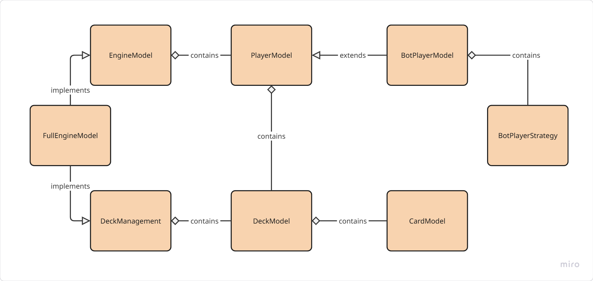
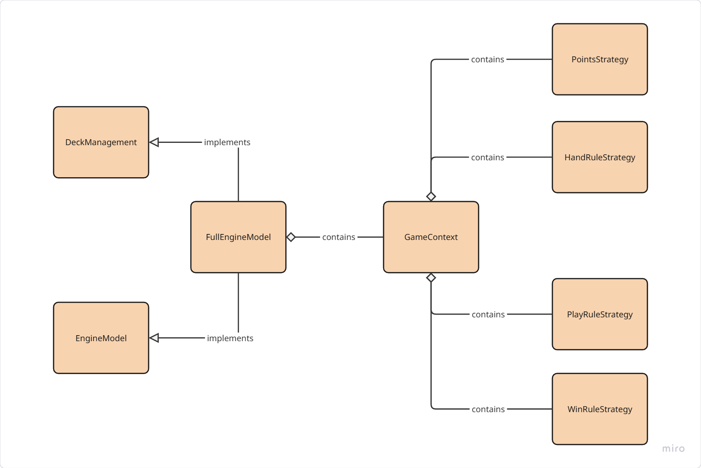

# Detailed Design

## DSL
The DSL uses a Builder pattern to generate a *FullEngineModel*. 
Specifically, *GameDSL* understands the instructions given in input and uses them accordingly to enrich an internal *GameBuilder*, which will then produce the model used during gameplay. 
To make the DSL syntax more intuitive and fluent, *GameDSL* uses *SyntacticSugar* to define certain fixed keywords and *SyntacticSugarBuilder* to handle longer and more complex instructions.

## Engine
The engine is structured around the Model-View-Controller (MVC) pattern, which separates the application into three interconnected components.
- *EngineController* manages the game flow between the main model *FullEngineModel* and the main view *EngineView*.
- *EngineView* handles the user interface, it initializes the view components inherited as mixins.
- *PlayerViewManager* is a mixin responsible for adding players to the main view, specifically managing their spatial positioning.
- *CardViewManager* manages the display of cards in the players' hands, including methods to interact with the cards.
- *TableViewManager* manages the display of the game table, including the cards played during the current turn.
- *TurnHistoryManager* holds the history of turns played, allowing the user to review past turn winners.
- *WindowState* maps *SwingUtilityFacade* in order to expose Swing methods in a functional manner.

- *FullEngineModel* implements the *EngineModel* trait which defines the core game logic and rules.
It also provides methods to interact with the deck of cards used in the game via the mixin *DeckManagement*.
- *DeckManagement* contains a *DeckModel* that contains the cards used in the game, modeled as a collection of *CardModel*.
- *PlayerModel* represents the players in the game and provides methods to interact with the cards in their hand, which is modeled as a *DeckModel*.
- *BotPlayerModel* extends *PlayerModel* and provides additional methods to let the bot play autonomously following a set strategy.

*FullEngineModel* only has methods to change the game state, which is represented by *GameContext*
- *GameContext* contains information about the current turn and the rules of the game, modeled as strategies.
- *HandRuleStrategy* is a strategy that defines the rules for playing cards from the hand.
- *PlayRuleStrategy* defines the rules for winning the turn (based on the cards played, which player has won).
- *PointStrategy* defines the correlations between cards and points (how many points is a card worth)
- *WinRuleStrategy* defines the rules for winning the game after the last turn is played.

| [Previous Chapter](../4-architectural_design/index.md) | [Index](../index.md) | [Next Chapter](../6-implementation/index.md) |