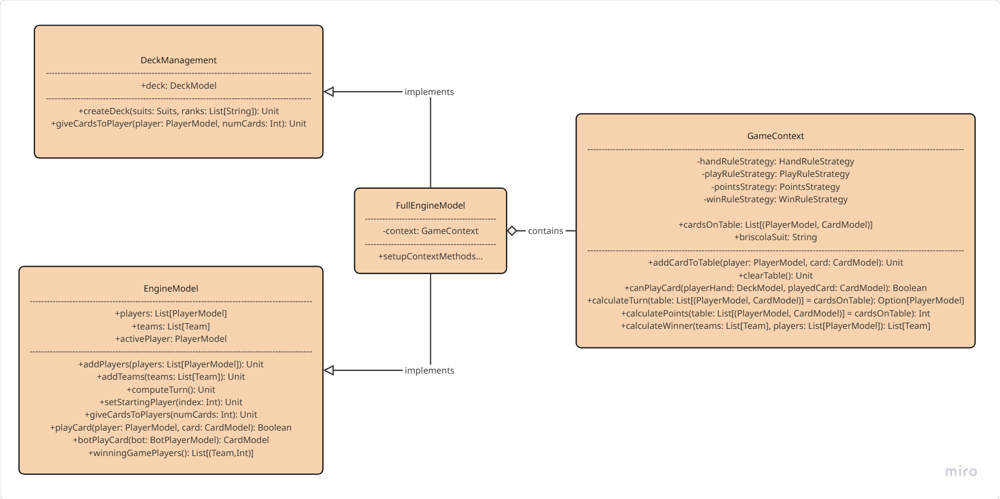
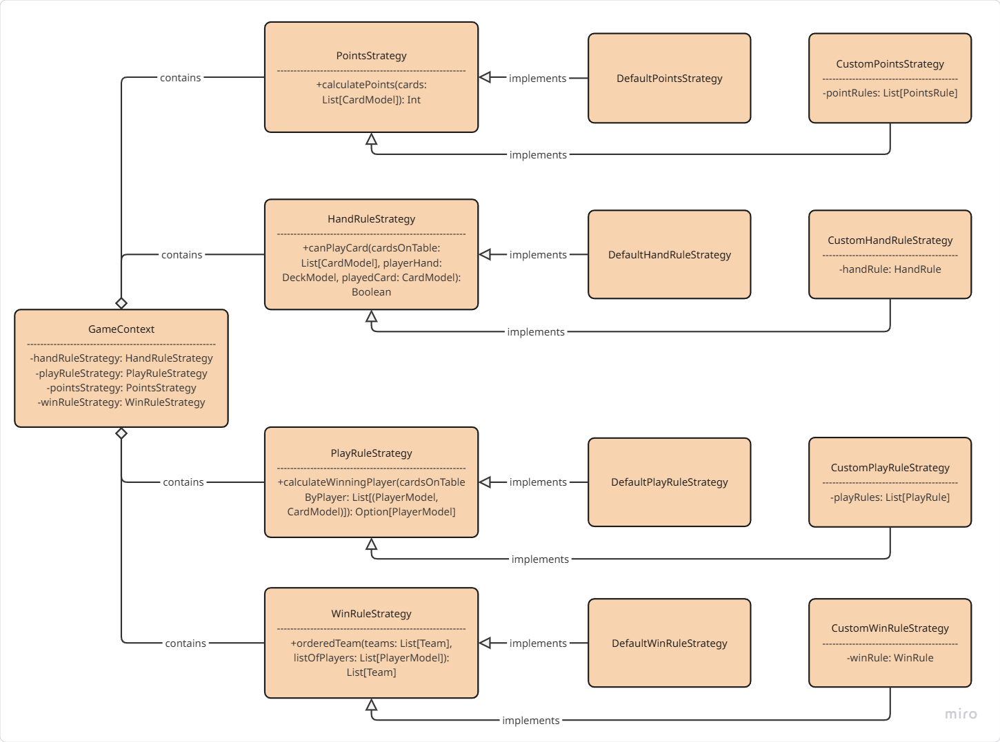

# Alni Riccardo
During the development of the project, I was primarily responsible for managing the model component of the game engine. 
I developed the core classes (*PlayerModel*, *DeckModel*, *CardModel*) and implemented the game logic handling within *EngineModel* and *GameContext*. 
I also worked on the implementation of the *HandRule* strategy.

## EngineModel
*EngineModel* acts as an interface between the game controller and the game state, managing controller-sent events like playing cards and computing turns.
Its implementation, *FullEngineModel*, extends the mixin *DeckManagement* that is responsible for deck-related logic, such as drawing cards.
*FullEngineModel* also encapsulates *GameContext*, that handles the underlying game rules and the current state of the game table.



## Rule Strategies
*GameContext* contains the game rules, modeled as four Strategy pattern, that define how the game should behave in terms of card rules, scoring, play logic, and winning conditions.
Every strategy has a default implementation which is used by *GameContext* if no custom rule is set by the user.
The default rules are:
- *Points Rule*: a card point correspond to its rank
- *Hand Rule*: no rules, the player can play any card from its hand
- *Play Rule*: the winning card is the one with the highest rank and that is of the same suit as the first card played during the turn (there is no briscola suit)
- *Win Rule*: the single player with the highest score at the end of the game wins



## Hand Rules
*HandRule*  is implemented as a lambda that takes as input the current cards on the table, the player's hand, and the card being played, and returns a Boolean indicating whether the play is valid according to the rule.
The user can create their own custom hand rules by defining a lambda that matches this structure:
```scala
(List[CardModel], DeckModel, CardModel) => Boolean
``` 
To make their use easier in the DSL, some basic rules have been created that can be used by specifying the context with *given/using* in the following way:
```scala
(cardsOnTable, playerHand, playedCard) =>
    given List[CardModel] = cardsOnTable
    given DeckModel = playerHand
    given CardModel = playedCard

    freeStart or followFirstSuit
```
These prefabricated rules, along with more readable logical operators that can be used to combine them, are defined as static methods in the *HandRule* object:
```scala
 def followFirstSuit(using
      cardsOnTable: List[CardModel],
      playerHand: DeckModel,
      playedCard: CardModel
  ): Boolean =
    cardsOnTable.nonEmpty &&
      (cardsOnTable.head.suit == playedCard.suit ||
        !playerHand.view.exists(_.suit == cardsOnTable.head.suit))
```