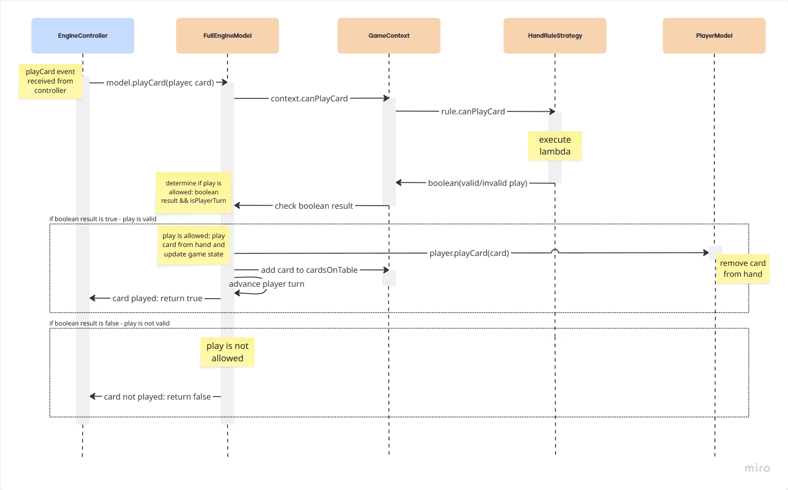

# Alni Riccardo
During the development of the project, I was primarily responsible for managing the model component of the game engine. 
I developed the core classes (`PlayerModel`, `DeckModel`, `CardModel`) and implemented the game logic handling within `EngineModel` and `GameContext`. 
I also worked on the implementation of the `HandRule` strategy.

## EngineModel
`EngineModel` acts as an interface between the game controller and the game state, managing controller-sent events such as playing a card (`playCard`) and calculating the result of the turn (`computeTurn`).
Its implementation, `FullEngineModel`, extends the mixin `DeckManagement` that is responsible for deck-related logic, such as drawing cards.
`FullEngineModel` also encapsulates a `GameContext` instance that handles the underlying game rules and the current state of the game table.


## Rule Strategies
The `GameContext` class is designed using the Strategy Pattern and encapsulates four key behaviors:
1. `PointsStrategy` computes points for a given set of cards
2. `HandRuleStrategy` validates if a card can be played from the player's hand
3. `PlayRuleStrategy` determines the winning card on the table for the current turn
4. `WinRuleStrategy` determines the game’s winning player(s)


Each of these strategies has a default implementation, but they can be overridden with custom logic to support different game variants.
The default rules are:
- *Points Rule*: a card point correspond to its rank
- *Hand Rule*: no restrictions, the player can play any card from its hand
- *Play Rule*: the winning card is the one with the highest rank and that is of the same suit as the first card played during the turn (there is no briscola suit)
- *Win Rule*: the single player with the highest score at the end of the game wins

The user can define custom game rules through the provided DSL. 
When building the game model using the DSL, the builder constructs a `GameContext` that replaces the default strategy implementations with their corresponding `Custom...Strategy` classes using the user-set rule.
The rules used by the `Custom...Strategy` classes (`PointsRule`, `HandRule`, `PlayRule` and `WinRule`) are all type aliases of lambda functions.

This design ensures that each rule is independent of the others, ensuring modularity and flexibility:
the user can freely customize any subset of the game rules, from a single type to the entire rule set, without compromising the integrity or playability of the game. 

## Play Card Example
To better demonstrate adherence to the Single Responsibility Principle and provide a clearer understanding of how the different components interact with each other, the following example illustrates a game event: a player's card play action.
1. The `EngineController` receives the event and invokes the `playCard` method of the `FullEngineModel`. 
2. This method validates whether the card is playable by checking compliance with the Hand Rule through a call to the `canPlayCard` method of the `GameContext`, which in turn delegates to the `canPlayCard` method of the `handRuleStrategy`.
3. The strategy method returns the result of its lambda expression (boolean), which propagates back as the return value of the initial `playCard` method to the controller: if the play is valid, it returns true; otherwise, false.
4. When the play is deemed valid, the execution flow continues by invoking the player's `playCard` method (which removes the card from the player's hand) and updating the table state by adding the just-played card to the cards on the table (`cardsOnTable` field of `GameContext`), and advancing the player's turn. 
5. Finally, the true/false result is returned to the `EngineController`.



## Hand Rules
`HandRule` is implemented as a lambda that takes as input the current cards on the table, the player's hand, and the card being played, and returns a Boolean indicating whether the play is valid according to the rule.
The user can create their own custom hand rules by defining a lambda that matches this structure:
```scala
(List[CardModel], DeckModel, CardModel) => Boolean
``` 
To make their definition easier in the DSL, some basic rules have been created that can be used by specifying the context with the *given/using* syntax in the following way:
```scala
(cardsOnTable, playerHand, playedCard) =>
    given List[CardModel] = cardsOnTable
    given DeckModel = playerHand
    given CardModel = playedCard

    freeStart or followFirstSuit
```
These prefabricated rules, along with more readable logical operators that can be used to combine them, are defined as static methods in the `HandRule` object:
```scala
 def followFirstSuit(using
      cardsOnTable: List[CardModel],
      playerHand: DeckModel,
      playedCard: CardModel
  ): Boolean =
    cardsOnTable.nonEmpty &&
      (cardsOnTable.head.suit == playedCard.suit ||
        !playerHand.view.exists(_.suit == cardsOnTable.head.suit))
```

| [Go Back to Implementation](../6-implementation/index.md) | [Index](../index.md) |