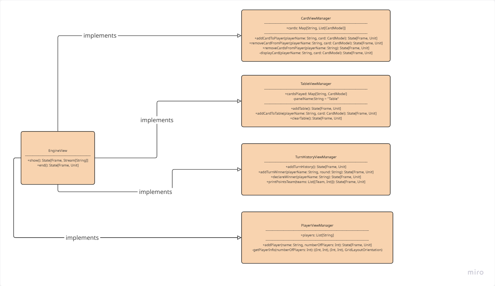

# Pesic Marco

In this project, I am responsible for the structure of the `EngineController`,
the implementation of view mixins (specifically `TableView` and `TurnHistory`), 
and the implementation of `WinRules` with support for team-based games.

I've worked on the following files: `EngineController`, `TableViewManager`, `TurnHistoryManager`, and `GameElements` (Team and WinRules).

## Engine Controller
  This class implements an event-driven, functional-style controller.
  It orchestrates interactions between the game model (`FullEngineModel`) and the GUI view (`EngineView`) using a custom `State[Window, A]` monad to handle side effects in a composable, purely functional way.

The only public method is `start` which initializes the game by setting up the view and rendering the initial state of the game.
```scala
 override def start(): Unit =
    val initialState =
      for
        _ <- view.addTurnHistory()
        _ <- view.addTable()
        _ <- model.players.foldLeft(unitState(): State[Window, Unit]):
          (state, player) =>
        for
          _ <- view.addPlayer(player.name, model.players.size)
          _ <- state
          _ <- renderHand(player)
        yield ()
    _ <- checkBot()
    yield ()
```

The window event handler is defined as a `State[Window, Unit]` that processes events from the window, such as clicks on specific components.
```scala
val windowEventsHandler: State[Window, Unit] = for
    events <- windowCreation
    _ <- seqN(events.map(event =>
        val parsedEvent = parseEvent(event)
        parsedEvent match
        case Left(error) =>
            println(s"Error parsing event: $error")
            unitState()
        case Right(CardPlayedEvent(playerName, card)) =>
            handleCardPlayed(playerName, card.name, card.rank.toString, card.suit)
        case _ =>
            println("Invalid event received")
            unitState()
    ))
    yield ()
```
The `handleCardPlayed` checks whether the player exists in the model and then moves the responsibility for checking the turn validity to the model through the `playCard` method.
```scala
private def handleCardPlayed(playerName: String, name: String , rank: String, suit: String): State[Window, Unit] =
  val card = CardModel(name, rank.toInt, suit)
  model.players.find(playerName == _.name) match
    case Some(player) => playCard(player, card)
    case None =>
      println(s"Player $playerName not found.")
      unitState()
```
The `playCard` method updates the game state and the view accordingly, and then calls `endTurn` to advance the game to the next player's turn.
```scala
    private def playCard(player: PlayerModel, card: CardModel): State[Window, Unit] =
      if model.playCard(player, card) then
        println(s"${player.name} played ${card.name} of ${card.suit}")
        playerTurn += 1
        for
          _ <- view.removeCardFromPlayer(player.name, card)
          _ <- view.addCardToTable(player.name, card)
          _ <- endTurn()
        yield()
      else
        unitState()
```
The difference between a `BotPlayerModel` and a `PlayerModel` is that the bot player automatically plays a card when it's their turn, by not passing through the eventHandler .
```scala
    private def playCardProgrammatically(bot: BotPlayerModel): State[Window, Unit] =
      val card: CardModel = model.botPlayCard(bot)
      for
        _ <- handleCardPlayed(bot.name, card.name, card.rank.toString, card.suit)
      yield()

    private def checkBot():State[Window, Unit] = {
      model.activePlayer match
        case bot: BotPlayerModel if bot.hand.view.nonEmpty => playCardProgrammatically(bot)
        case _ => unitState()
    }
```
## View

### WindowState
To integrate Java Swing with minimal Java code, a `SwingFunctionalFacade` is implemented. This facade exposes only essential methods
`WindowState` serves as a functional wrapper around the Java facade. It maps each facade method to a corresponding state transformation. Additionally, it introduces a Window type alias to abstract away the underlying java.awt.Frame type, reducing direct dependency on the Java Swing library.
### EngineView
The `EngineView` singleton provides high-level methods that the Controller uses to update the View's state. Each method returns a `State[Window, Unit]`, enabling their composition via for-yield blocks when constructing or updating the View.



```scala
sealed trait EngineView
    extends PlayerViewManager
    with CardViewManager
    with TableViewManager
    with TurnHistoryViewManager:
  def show: State[Frame, Stream[String]]
  def end(): State[Frame, Unit]
```
## Team and Win Rules
A Team is a List of Player names
```scala
type Team = List[String]
```
We set up every game such that every player is a part of a team, composed byy himself if not explicitly assigned to a team.
This allows for flexibility in team configurations, such as single-player games or games with multiple teams.

The 'Win Rules' is implemented as a lambda that takes as input a list of teams and the list of all players in the game and returns an ordered list of teams.
The user can create their own custom win rules by defining a lambda that matches this structure:
```scala
(List[Team], List[PlayerModel]) => List[Team]
```

To make their definition easier in the DSL, some basic rules have been created that can be used by specifying the context with the *given/using* syntax in the following way:
```scala
(teams, listOfPlayers) =>
        given List[Team] = teams
  
        given List[PlayerModel] = listOfPlayers
  
        highestPointTeam
```
This allows users to define custom win rules that can be tailored to specific game variants or preferences, while still adhering to the overall game structure and logic.
Two basic win rules have been implemented: highestPointTeam and lowestPointTeam.
```scala
  def highest(using
      teams: List[Team],
      players: List[PlayerModel]
  ): List[Team] =
    val playerScores = players.map(player => player.name -> player.score).toMap

    // Calculate the total score for each team
    val teamsWithScores = teams.map(team =>
      val totalScore =
        team.map(playerName => playerScores.getOrElse(playerName, 0)).sum
      (team, totalScore)
    )

    val orderedTeams = teamsWithScores.sortBy(-_._2).map(_._1)
    orderedTeams
```


| [Go Back to Implementation](../6-implementation/index.md) | [Index](```../index.md) |


