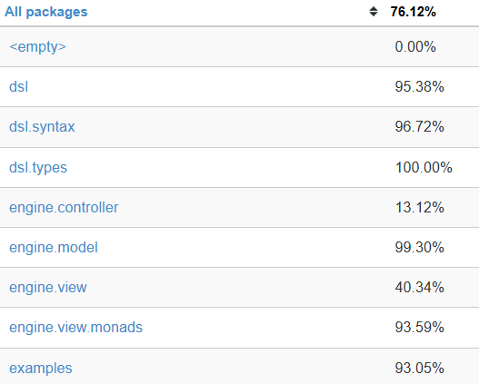

# Testing
## Technologies 
Scala Test has been used for unit testing along with automated sbt testing using GitHub-native workflows.

## Methodology
We tried to follow a Test-Driven Development (TDD) approach, where tests are written before the actual implementation of the feature. This allows us to ensure that each feature works as intended and to catch bugs early in the development process.
After the implementation of a feature, we also checked the coverage of the tests using Scoverage, possibly improving the coverage by adding more tests.

## Coverage
Scoverage reported a coverage of 76.12% for the project which is a bit lower than 80%, that was our aim since the start.
The full scoverage report can be found [here](scoverage-report/index.html), or at PPS-24-Briscala/target/scala-3.3.6/scoverage-report/index.html.

The main culprits for lowering the coverage are some elements of the GUI, which are not easily testable, and most parts of *EngineController* which are not accessible for tests due to the way the code is structured.
We are satisfied with the coverage of the other packages as it is solidly above 90%.

To manually check the coverage report, a command alias was added to the sbt configuration.

By running 
`sbt scoverage` a complete coverage report will be generated.
## Example
We wrote an implementation of the *GameBuilder* trait called *SimpleGameBuilder*.
This class acts like a mockup for the *GameBuilder* with a less rigid structure, allowing us to better test the trait.

| [Previous Chapter](../6-implementation/index.md) | [Index](../index.md) | [Next Chapter](../8-retrospective/index.md) |